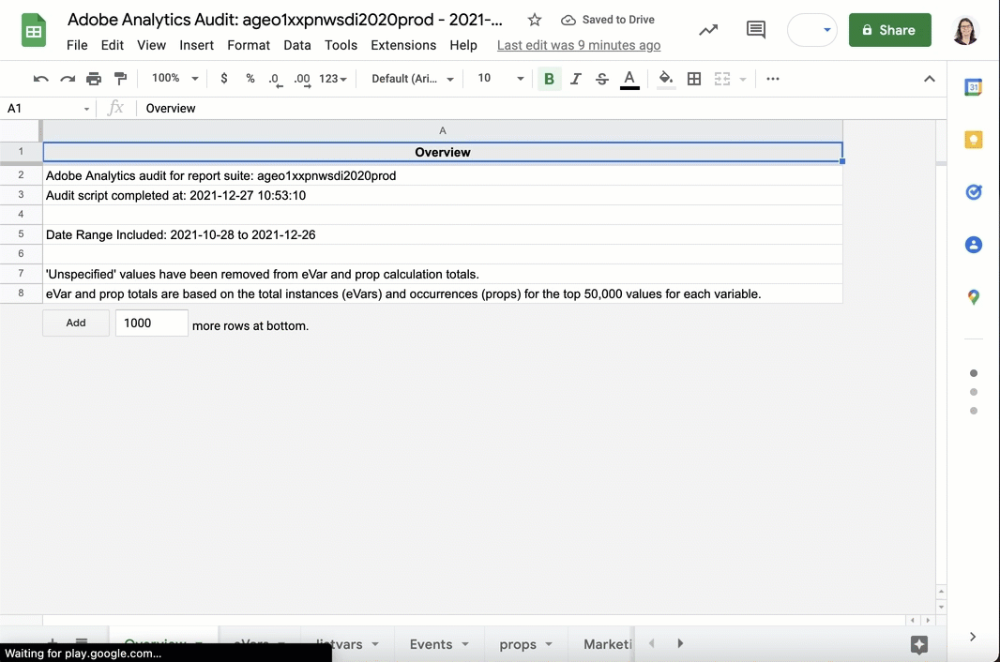

# Adobe Analytics Audit Script (v2 API)

This script is intended as a way to get an overall view of a report suite, including:

* Data completeness (how many eVars/listvars/props/events) are enabled but have no data
* Documentation completeness (presence of descriptions)
* Classifications--how many exist and how many have data
* Some other various and sundry checks

To run it, you will need:

* Access to the Adobe Analytics account and report suite (you do _not_ need web services credentials)
* The **company ID** (you can get this by running `get_me()` after loading `adobeanalyticsr`)
* The **report suite ID** to process (you can get this by running `aw_get_reportsuites()` after loading `adobeanalyticsr`)

## Output Summary / Examples

There are two main artifacts generated by this process.

The first is a standalone HTML file that does some basic assessment of the different variable types: how many have data, which ones have no (or very little) data for the assessed time period, whether the Marketing Channels have anything obviously off in them, etc.

Below is an animation of what that output looks like:

Included at the beginning of the HTML file is a link to a Google Sheet that also gets generated as part of the process. The Google Sheet has the actual details for each enabled variable: how much traffic it has recorded, and, in the case of dimensional variables (eVars, listvars, and probs), the top five values for each variable (including classifications):

This file can easily be downloaded as an Excel file if that is your preferred spreadsheet platform.

## Important Setups/Checks for Writing to Google Sheets

You will need at least version **1.0.0** of the **googlesheets4** package for this script to work.

The first time you use this script, go ahead and:

1. Manually load **googlesheets4** by entering `library(googlesheets4)` in the console.
2. Enter `gs4_create("Test Sheet")` in the console. You should be prompted to log into Google and give permission to the app to read/write/delete Google Sheets files. _You have to agree to these permissions_.
3. Once the above successfully runs, go to **My Drive** in Google Drive and confirm that a **Test Sheet** Google Sheets file was created. You can delete it, but, if it was not created, you will have to figure out why, as the script will run for a good, long while and then...crap out at the end otherwise.

## The Main Instructions for Running the Script

Once you have successfully checked/completed/confirmed the steps above (one-time), then use the following steps to run the script:

1. Open `adobe_analytics_audit.Rmd`
2. Update the three "params" at the top of the file with the **company ID**, **report suite ID**, and a **Google Account email address** (the script will create a Google Sheet in the home of your **My Drive**)
3. IF it has been more than 24 hours since you have successfully run the script, run the first "chunk" (click the green arrow at the top right). This _should_ prompt you to log in to Adobe and paste in an updated token. (Because we're _knitting_ the file in the next step, which is a "non-interactive environment," the script cannot prompt you to enter a token, so it will fail if a non-expired Adobe Analytics token does not exist already.)
3. Select **Knit**. It may take 10-30 minutes to run depending on the number of variables
4. Open **adobe_analytics_audit.html** in a web browser and review the results!

If you run into any errors or have any questions, contact [Tim Wilson](tim.wilson@searchdiscovery.com). If you find a bug, you can also log an issue in the [repo on GitHub](https://github.com/SDITools/adobe_analytics_audit/issues). You can also log feature requests / enhancement ideas there.
